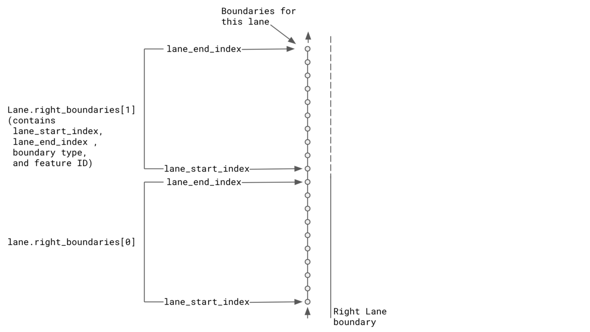
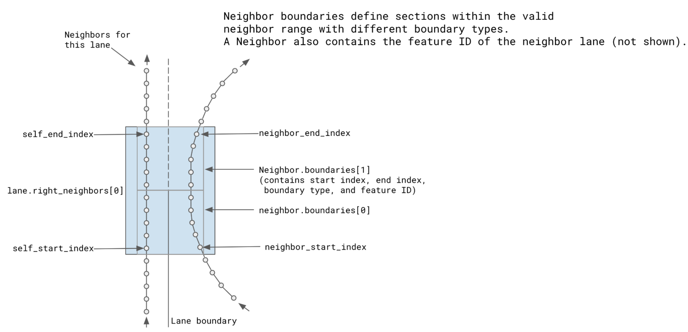

# Waymo Open Dataset Lane neighbors and boundaries

Copyright © 2021 Waymo LLC.

## Lane Boundaries

Boundaries are stored in the map feature protocol buffers as segments of the lane (a start and end index into the lane polyline) where a particular boundary is adjacent to the lane.  There may be multiple different boundaries adjacent to a single lane feature as it passes different road features.

## Lane Neighbors

Neighbors are stored as segments of the lane (a start and end index into the lane polyline) each associated with a segment of the neighboring lane.  Within the neighbor segment the boundary (or multiple different boundaries) between the lane and its neighbor are also stored as segments of the lane. These can be used to determine the boundary type that would be crossed during a lane change from any lane point with a neighboring lane.

